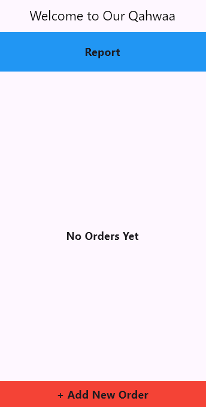
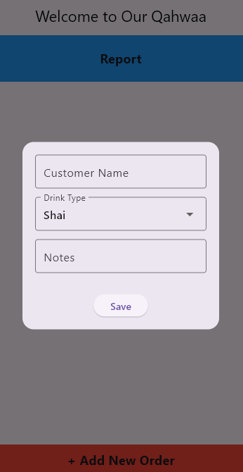
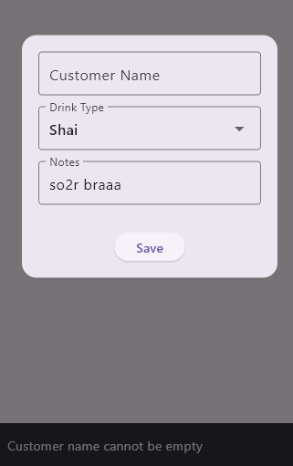
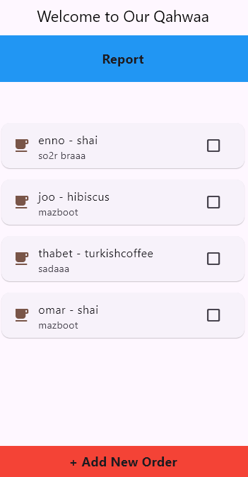
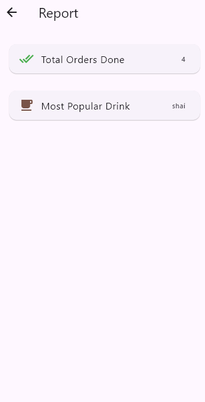

# ☕ Qahwaa Project

A simple **Coffee Shop Manager App** built with **Flutter**.  
It helps coffee shop owners manage customer orders, track completed drinks, and generate sales reports.

---

## 🚀 Features
- Add new orders with:
  - Customer name
  - Drink type (Dropdown list)
  - Special notes
- Mark orders as **Completed**
- Generate **Reports**:
  - Total number of completed orders
  - Most popular drink (auto-calculated)

---

## 🛠️ Tech Stack
- **Flutter** (UI & State Management)
- **Dart** (Business logic)
- **Material Design** components

🏗️ Architecture & Principles

- Built using OOP (Object-Oriented Programming) concepts such as:

- Encapsulation

- Abstraction

- Inheritance

- Polymorphism

- Applied SOLID principles to keep the code maintainable, scalable, and clean.

## 📸 Screenshots
> *(Add your app screenshots here)*  

- Dashboard screen  

- Add new order 
 
 
- Orders screen  
 
- Report screen
 

---

## 📂 Project Structure

lib/
┣ data/
┃ ┣ models/
┃ ┃ ┗ drink_model.dart
┃ ┣ repo/
┃ ┃ ┗ in_memory_order_repo.dart
┃ ┗ services/
┃ ┗ order_manager.dart
┣ views/
┃ ┣ qahwaa_dashboard.dart
┃ ┗ report_view.dart
┗ main.dart